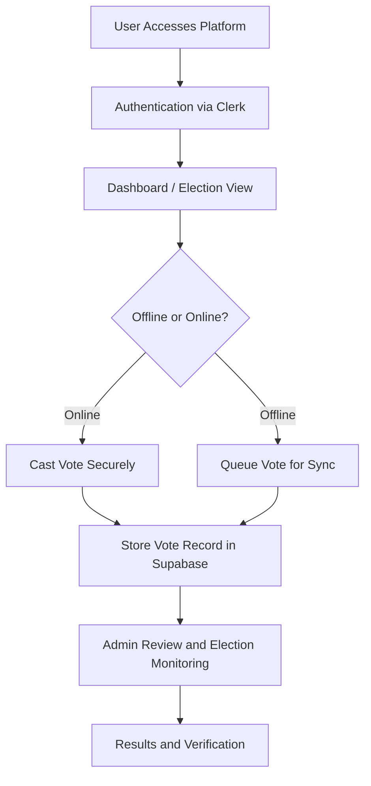

<p align="center">
  
</p>

# e-Vote: An Offline-First, Electronic Voting System for Academic and Institutional Elections

e-Vote is a modern, secure, and resilient digital voting platform designed for academic and institutional elections. The system aims to provide a trustworthy, accessible, and offline-capable voting experience while maintaining transparency, integrity, and ease of administration.

## 🛠️ Tech Stack

The project is built with a modern full-stack architecture focused on reliability and scalability:

- Next.js 16 with the App Router
- React 19 and TypeScript
- Clerk for authentication and secure access control
- Supabase for PostgreSQL database, real-time data handling, and Row Level Security
- CSS Modules for polished, component-based UI styling
- Mermaid for flow and system documentation

## 🎯 Problem We Are Solving

Traditional voting processes in academic institutions often face several challenges:

- Manual or paper-based voting is slow, error-prone, and difficult to audit
- Limited access to secure digital participation for students and staff
- Vulnerability to duplicate voting, tampering, and inconsistent record keeping
- Poor resilience in environments where internet connectivity may be unreliable

## 💡 Solution

e-Vote addresses these issues by providing a digital election platform that is:

- Secure and authenticated through institutional identity management
- Designed to support fair, verifiable voting processes
- Structured for offline-friendly operation and future synchronization workflows
- Easy to manage for administrators, candidates, and voters

## ✨ Key Features

- Secure voter authentication and role-based access
- Election and candidate management for administrators
- Student-facing dashboard for active and upcoming elections
- Vote verification and receipt support
- Offline-ready architecture for resilient institutional deployments
- Audit-friendly data structure for review and accountability

## 📁 File Structure

```text
src/
  app/
    admin/
    auditor/
    candidate/
    dashboard/
    ec/
    election/
    voter/
    api/
    sign-in/
    sign-up/
  components/
  lib/
public/
  assets/
```

## 🔄 How It Works

The workflow below illustrates the core flow of the e-Vote system:



## 🚀 Getting Started

### Prerequisites

Make sure you have the following installed:

- Node.js
- npm

### Installation

```bash
git clone <your-repository-url>
cd e-Vote
npm install
```

### Environment Variables

Create a `.env.local` file in the root directory and configure the following values:

```env
NEXT_PUBLIC_CLERK_PUBLISHABLE_KEY=your_clerk_publishable_key
CLERK_SECRET_KEY=your_clerk_secret_key
CLERK_WEBHOOK_SECRET=your_webhook_secret

NEXT_PUBLIC_CLERK_SIGN_IN_URL=/sign-in
NEXT_PUBLIC_CLERK_SIGN_UP_URL=/sign-up
NEXT_PUBLIC_CLERK_AFTER_SIGN_IN_URL=/dashboard
NEXT_PUBLIC_CLERK_AFTER_SIGN_UP_URL=/dashboard

NEXT_PUBLIC_SUPABASE_URL=your_supabase_url
NEXT_PUBLIC_SUPABASE_ANON_KEY=your_supabase_anon_key
SUPABASE_SERVICE_ROLE_KEY=your_service_role_key
```

### Run the Development Server

```bash
npm run dev
```

Open http://localhost:3000 in your browser to view the application.

## 🧱 Database and System Design

The application uses a relational data model centered around election management and secure vote recording. Core entities include:

- Voters
- Elections
- Candidates
- Votes
- Admin and institutional roles

This design supports integrity, role-based access, and future expansion for more advanced electoral processes.

## 📌 Project Purpose

This project is developed as a Capstone Project focused on practical innovation in digital governance, secure systems, and user-centered design for institutional use.

## 👏 Project Credits

Project Hail Mary

Developers:
- EGABO AARON
- NATOZO PATIENCE MARTHA
- NIWASIIMA ASHELYCOLE

Supervised by:
- MR. KUMAKECH MICHAEL

---

Built with purpose, integrity, and a vision for modern digital elections.
